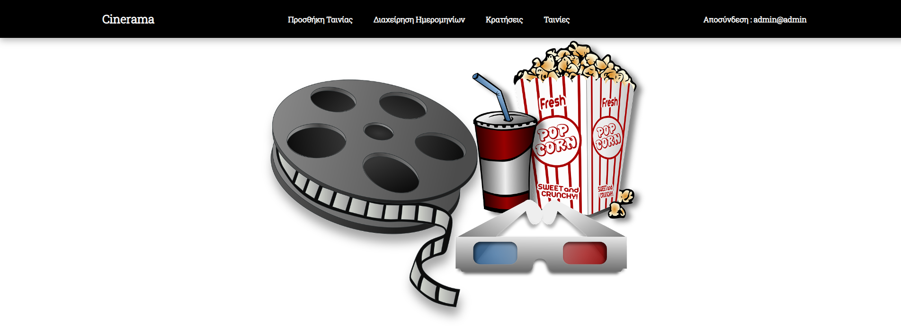

<b>Cinerama</b> is a website that allows registered users to book tickets online for a cinema. Implements 2 user roles, the roles of user and admin, each with their own set of privileges and accesses.

<h3>Technologies:</h3>
    
Laravel, Html, Css, Jquery, Javascript, Php, Sql

<h4>Homepage</h4>

 

<h4>Admin role can add a new movie</h4>

 

<h4>Admin role with all user reservations</h4>

 

<h4>User role, can book tickets for a show.</h4>

 

